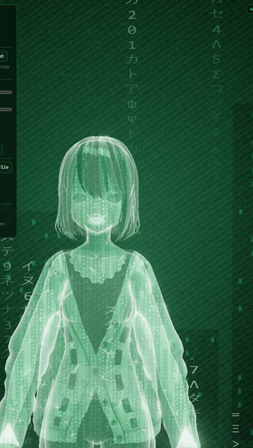

# Matrix Host

A browser-native, controllable, talking digital host. One repo, three rendering tiers that share a single idea: you own the character, the pixels, and the control surface. Tier 1 renders a rigged 3D avatar as a living Matrix hologram at 60 fps in a plain browser tab. Tier 2 directs real AI-generated video footage live (segment state machine, mouth warp, blink, overlay grade). Tier 3 streams real model-generated frames from a rented GPU box over WebRTC, with the browser as viewport and command channel. Free and open tools end to end; no vendor lock.



## The three tiers

| Tier | Page | What renders | When to use it |
| --- | --- | --- | --- |
| 3D hologram | `index.html` | Rigged VRM avatar (or GLB logo) with the hologram shader, fully interactive | Live shows today. Zero cost, zero latency, works offline, full gesture/emotion/voice control |
| Living Footage | `footage.html` | Real video pixels, directed live: segments, mouth-warp lip-sync, blink, glyph/rain/grade overlay, luma-key alpha | When you want photoreal or cinematic quality and you have (or generate) source footage of your character |
| GPU stream | `stream.html` | Frames generated by a real model (talking-head animation) on a rented GPU box, streamed via WebRTC | When you want model-driven photorealism per utterance. Costs the GPU rental while live, roughly $1 to $3 for a 3 hour show on RunPod |

Rule of thumb: start on tier 1 (it is finished and free), move a character to tier 2 when you have footage of it, rent tier 3 for shows where photoreal matters.

## Quickstart

```bash
pnpm install
pnpm dev
```

Vite serves three pages (open the URL it prints, then pick a path):

- `/index.html` (or just `/`): the 3D hologram host
- `/footage.html`: the Living Footage host
- `/stream.html`: the GPU stream viewport

Other scripts: `pnpm build`, `pnpm preview`, `pnpm typecheck`.

## Control surface: `window.matrixHost` (3D tier)

The demo page exposes the engine globally. Everything the panel does, code can do.

```js
await matrixHost.loadSubject('./avatars/victoria.vrm') // any .vrm, or .glb logo
matrixHost.setBackground('transparent')                // 'matrix' | 'transparent'
matrixHost.setHeadLook(30, -5)                         // degrees yaw, pitch
matrixHost.wave()                                      // hand + finger wave
matrixHost.point()                                     // point at camera
matrixHost.scold()                                     // point + finger wag + stern face
matrixHost.yell()                                      // lean in, angry, mouth working
matrixHost.setEmotion('happy')                         // neutral|happy|angry|sad|relaxed
await matrixHost.speak('https://…/tts.mp3')            // URL, Blob/File, or MediaStream
matrixHost.setVisemes({ aa: 0.6 })                     // external mouth drive; null returns control to the analyser
matrixHost.speakDemo()                                 // procedural voice, no audio file needed
const webm = await matrixHost.record(8)                // canvas capture to webm Blob
matrixHost.pointAt(x, y)                               // articulated point at screen coords <!-- verify-at-integration -->
matrixHost.setFraming('closeup')                       // camera framing presets <!-- verify-at-integration -->
```

Ships with a roster in `public/avatars/` (Alicia, Victoria, school girl, guy, girl, boy). Drop any `.vrm` on the page, or make your own free in [VRoid Studio](https://vroid.com/en/studio). A `.glb` gets the same hologram treatment with no rig (logo mode).

The footage tier has its own surface, `window.footageHost`: `playSegment(name)`, `holdSegment(name)`, `release()`, `blinkNow()`, `speak(...)`, `setBackground('scene'|'transparent')`, `record(seconds)`. Segments for the bundled reference footage are mapped in `src/footage.ts`.

## Voice

<!-- verify-at-integration: src/voice.ts and window.hostVoice are being built this wave; API below is the target surface -->

Three engines, one `window.hostVoice` surface, all free to start:

| Engine | What it is | Cost | Notes |
| --- | --- | --- | --- |
| System voice | Browser `speechSynthesis` | Free, offline | Instant, robotic-adjacent. Mouth driven via `matrixHost.setVisemes()` because system TTS exposes no audio stream |
| Kokoro | Kokoro-82M neural TTS in the browser via `kokoro-js` (already a dependency) | Free, Apache-2.0 | One-time model download of roughly 90 MB, then runs locally on WebGPU or WASM |
| ElevenLabs | Cloud TTS with your API key | Free tier exists; paid beyond | Key goes in the page's key field and is held in memory only, never persisted |

Spoken control (`VoiceCommands`, Web Speech API): say "wave", "point", "look left", "be angry", "say hello everyone", "transparent", "stop listening" and the host obeys.

ElevenLabs without the voice panel works today with zero glue, because `speak()` accepts a Blob:

```js
const response = await fetch('/api/tts?text=hello') // your proxy that calls ElevenLabs
await matrixHost.speak(await response.blob())       // mouth syncs automatically
```

## OBS / Whatnot overlay

The transparent mode renders the avatar over true alpha; the checkerboard you see in the demo is page CSS to prove it, OBS itself composites real transparency.

1. In OBS add a Browser source pointing at the dev URL (for example `http://localhost:5173/index.html`; use whatever `pnpm dev` prints).
2. Right-click the source, Interact, click the Transparent button (there is no URL flag for it; the button is the switch).
3. In the source's Custom CSS, hide the demo chrome and kill the demo checkerboard:

```css
#panel, #fps { display: none; }
body.transparent-mode.show-checker { background: transparent !important; }
```

4. Layer the source over your Whatnot (or any) stream scene. The hologram sits on your feed with clean edges; `footage.html` does the same via luma key.

## GPU tier (photoreal frames on demand)

The browser is only a viewport plus a command channel. A rented GPU box (RunPod RTX 4090 at roughly $0.35 to $0.70/hr, or AWS g6.xlarge L4 at roughly $0.80/hr) runs `gpu-server/server.py`, an aiortc WebRTC server that streams model-generated frames and answers `{cmd:"speak", text}` over a data channel. You can prove the whole transport on your laptop with no GPU:

```bash
node gpu-server/dev-server.mjs   # ffmpeg to MJPEG over ws://localhost:8789
pnpm dev                         # open /stream.html, Connect
```

The generator seam swaps a CPU test loop for a real talking-head model (`GENERATOR=cpu|musetalk|ditto` <!-- verify-at-integration -->). Full technical runbook: [`gpu-server/README-gpu.md`](gpu-server/README-gpu.md). Owner path from zero to a talking avatar: [`docs/day-1-gpu-checklist.md`](docs/day-1-gpu-checklist.md). How it compares to HeyGen: [`docs/heygen-parity.md`](docs/heygen-parity.md). System design: [`docs/architecture.md`](docs/architecture.md).

## Licenses (free tools only, end to end)

| Component | License | Commercial use |
| --- | --- | --- |
| Three.js, @pixiv/three-vrm, Vite | MIT | Yes |
| Kokoro-82M TTS (`kokoro-js`) | Apache-2.0 | Yes |
| Ditto talking-head (antgroup/ditto-talkinghead) | Apache-2.0 | Yes |
| MuseTalk (TMElyralab) | MIT (code and weights) | Yes |
| LivePortrait | EXCLUDED: its InsightFace dependency is non-commercial | No, deliberately not used |
| Bundled sample avatars | Per-model (see credits below) | Check each; make your own in VRoid Studio to own it outright |
| `public/footage/reference.mp4` | DEV-ONLY calibration asset (from an X post) | No. Production requires owner-generated footage |

## Capability map (honest)

Solid today:

- Talking head with real lip-sync, gestures, emotions, head look, at 60 fps, free, in the 3D tier
- Portrait realism at the quality of your source art: the footage tier and the GPU talking-head models animate YOUR pixels, they do not invent quality you did not feed them
- True-alpha overlay for OBS/Whatnot in both browser tiers
- Full scriptable control surface and canvas recording

Frontier (not promised, not shipped):

- Real-time photoreal full-body generation. That is diffusion-over-rig or autoregressive video territory: bigger GPUs, visible artifacts, identity drift on long runs. The architecture has the seam for it (same Generator interface), the models are not there yet at show quality.

## Model credits

- `public/avatars/alicia.vrm`: Alicia Solid, © DWANGO Co., Ltd., the official niconico sample character (from [vrm-c/UniVRM](https://github.com/vrm-c/UniVRM) test models). Check the model's own license before commercial use.
- `public/avatars/victoria.vrm`: CC0.
- `public/avatars/girl.vrm`, `public/avatars/boy.vrm`: VRoid Studio sample exports from [madjin/vrm-samples](https://github.com/madjin/vrm-samples).
- `public/avatars/schoolgirl.vrm`, `public/avatars/guy.vrm`: roster samples; check each model's own terms before commercial use.
- For production, generate your own avatar in VRoid Studio (free); then the subject is 100% yours.

## Stack

Three.js + @pixiv/three-vrm + kokoro-js + Vite + TypeScript in the browser; aiohttp + aiortc + OpenCV in `gpu-server/`. The 3D and footage tiers need no server, no API keys, no paid anything.
